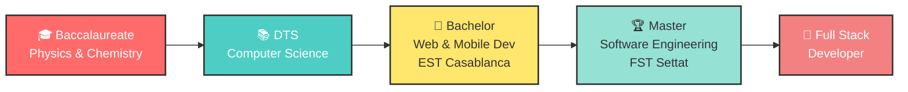

<div align="center">

# 🌟 KARIM NIZAR


<br/>

[](https://www.google.com/maps/place/Casablanca)
[](mailto:knizar505@gmail.com)
[](tel:+212700178651)


</div>

---

## 🎨 WHO AM I?

<div align="center">

```ascii
╔═══════════════════════════════════════════════════════════════════╗
║  🎯 MISSION: Crafting Digital Magic with Clean Code & Creativity  ║
╚═══════════════════════════════════════════════════════════════════╝
```

</div>

<table>
<tr>
<td width="50%">

### 🔥 THE ESSENTIALS

```yaml
name: Karim Nizar
role: Full Stack Developer
location: Sidi Maarouf, Casablanca 🇲🇦
company: Indegate Consulting
status: Building Cool Stuff 🚀

education:
  - Master in Software Engineering (FST Settat)
  - Bachelor in Web & Mobile Dev (EST Casablanca)

languages:
  - Arabic: Native 🗣️
  - French: Fluent 🥖
  - English: Fluent 🌍
```

</td>
<td width="50%">

### ⚡ WHAT MAKES ME TICK

```javascript
const karim = {
  passions: [
    "🎨 Pixel-Perfect Design",
    "📱 Smooth Mobile Experiences",
    "🏗️ Clean Architecture",
    "🤖 AI Integration",
    "☕ Coffee-Driven Development"
  ],
  
  mindset: "Code is poetry written in logic",
  
  workflow: [
    "💡 Think", "✍️ Design", 
    "⚡ Build", "🚀 Deploy"
  ]
};
```

</td>
</tr>
</table>

---

## 🛠️ MY TECH ARSENAL

<div align="center">

### ⚡ FRONTEND WIZARDRY


### 🔧 BACKEND POWERHOUSE


### 📱 MOBILE MAGIC


### 🗄️ DATABASE MASTERY


### 🚀 DEVOPS & DEPLOYMENT


### 🎯 TOOLS & METHODS


</div>

---

## 💼 CURRENT ADVENTURE @ INDEGATE

<div align="center">

### 🏢 Full Stack Developer | May 2025 - Present


</div>

<table>
<tr>
<td width="50%" valign="top">

### 📱 MOBILE MASTERPIECES

#### 🎯 **Gestion 22 Delegation**
*Flutter + Laravel + AI Magic*

```diff
+ Smart Consultations Management
+ Dynamic Agenda System
+ Events Tracking
+ Trello-Style Task Board
+ Real-Time Chat Messaging
+ AI-Powered Expert Chatbot
+ Secure Auth & Authorization
+ Advanced Analytics Dashboard
```

**Tech Stack**: `Flutter` `Laravel` `REST API` `AI Integration`

</td>
<td width="50%" valign="top">

### 🌐 WEB CREATIONS

#### 💻 **Indegate Official Website**
Modern, responsive corporate site  
**Stack**: `Next.js` `React` `Tailwind`  
🔗 [indegate.vercel.app](https://indegate.vercel.app/)

#### 🏥 **KYT Solutions Morocco**
Healthcare platform + Custom logo  
**Stack**: `Next.js` `Custom Design`  
🔗 [sanitaire.kytmaroc.com](https://sanitaire.kytmaroc.com/)

#### 📊 **Indatex Platform**
Market analysis & research tools  
**Stack**: `Next.js` `Analytics`  
🔗 [indatex.io](http://indatex.io/)

</td>
</tr>
</table>

<div align="center">

### 🎨 MY RESPONSIBILITIES

```
┌─────────────────────────────────────────────────────────────┐
│ 🏗️  Architecting Complex Flutter Apps                      │
│ ⚡  Designing Scalable RESTful APIs                         │
│ 🎨  Building High-Performance Web Apps                      │
│ ☁️  Server Deployment & Management                          │
│ 🎭  Brand Identity & Logo Design                            │
└─────────────────────────────────────────────────────────────┘
```

</div>

---

## 🎓 EDUCATIONAL JOURNEY

<div align="center">



</div>

---

## 🚀 FEATURED PROJECTS SHOWCASE

<div align="center">

<table>
<tr>
<td align="center" width="33%">

### 📱 Gestion 22


Complete management system with chat, Trello board & AI chatbot

**Status**: 🔒 *Production*

</td>
<td align="center" width="33%">

### 💪 Gym Management


Full-featured gym solution: planning, payments, tracking & admin panel

**Status**: ✅ *Complete*

</td>
<td align="center" width="33%">

### 🏢 Indegate Site


Modern corporate website

🔗 [Visit Live](https://indegate.vercel.app/)

</td>
</tr>
<tr>
<td align="center" width="33%">

### 🏥 KYT Solutions


Healthcare platform + logo design

🔗 [Visit Live](https://sanitaire.kytmaroc.com/)

</td>
<td align="center" width="33%">

### 📊 Indatex


Market research & analysis platform

🔗 [Visit Live](http://indatex.io/)

</td>
<td align="center" width="33%">

### 💼 Invoice System


Complete invoicing with automation

**Status**: 📁 *Professional*

</td>
</tr>
</table>

</div>

---

## 💪 SUPERPOWERS & SKILLS

<div align="center">

<table>
<tr>
<td align="center" width="20%">

### 🎯 AUTONOMY
```
█████████░ 90%
```
Self-driven & independent

</td>
<td align="center" width="20%">

### ⏱️ TIME MGMT
```
██████████ 95%
```
Deadline crusher

</td>
<td align="center" width="20%">

### 🤝 TEAMWORK
```
██████████ 100%
```
Collaboration master

</td>
<td align="center" width="20%">

### 👑 LEADERSHIP
```
████████░░ 80%
```
Team motivator

</td>
<td align="center" width="20%">

### 💡 CREATIVITY
```
██████████ 100%
```
Innovation junkie

</td>
</tr>
<tr>
<td align="center" width="20%">

### 🔄 FLEXIBILITY
```
██████████ 95%
```
Adapts quickly

</td>
<td align="center" width="20%">

### 🧩 PROBLEM SOLVING
```
██████████ 100%
```
Debug ninja

</td>
<td align="center" width="20%">

### 💬 COMMUNICATION
```
█████████░ 85%
```
Clear & concise

</td>
<td align="center" width="20%">

### 🎨 DESIGN SENSE
```
█████████░ 90%
```
UX/UI enthusiast

</td>
<td align="center" width="20%">

### ⚡ SPEED
```
█████████░ 90%
```
Fast & efficient

</td>
</tr>
</table>

</div>

---

## 🌟 EXPERIENCE TIMELINE

<details open>
<summary><b>🔍 Click to explore my journey</b></summary>

<br/>

### 🚀 **Indegate Consulting** — Developer Intern
`February 2025 - May 2025` | Casablanca

```yaml
focus:
  - 📚 Intensive Flutter, Laravel & Next.js training
  - 🏗️ Prepared for enterprise-scale projects
  - 👥 Learned from senior developers
  - 🎯 Best practices & clean architecture
```

---

### 💼 **Fiduciaire Brighten** — Full Stack Developer
`March 2024 - May 2024` | Casablanca

```yaml
achievements:
  - 🚀 Deployed multiple Laravel apps to production
  - 💳 Built invoice management system (React + Laravel)
  - 📋 Created quotation platform
  - 🔧 Automated workflows & processes
```

---

### 🚗 **Car Rental Agency** — Backend Developer

```yaml
project:
  - 📅 Appointment & quotation system
  - Stack: Laravel + Bootstrap + Tailwind + AdminLTE
  - 📧 Mass email functionality
  - 🎯 Template integration
```

---

### 🌐 **Remote Work** — Web Developer
`January 2023 - April 2023`

```yaml
deliverable:
  - 🚗 Driving school management platform
  - Stack: Java JEE + Bootstrap + Oracle SQL
  - 📊 Complete tracking system
  - 🎓 Student & course management
```

</details>

---

## 🎯 WHAT I'M UP TO

<div align="center">

<table>
<tr>
<td align="center" width="33%">

### 🔨 WORKING ON
```
📱 Flutter Mobile Apps
⚡ Scalable APIs
🌐 Modern Web Apps
```

</td>
<td align="center" width="33%">

### 📚 LEARNING
```
☁️ AWS/GCP Cloud
🤖 AI/ML Integration
🏗️ Microservices
```

</td>
<td align="center" width="33%">

### ❤️ INTERESTS
```
🌟 Open Source
✍️ Tech Blogging
👥 Mentoring Devs
```

</td>
</tr>
</table>

</div>

---

## 📫 LET'S BUILD SOMETHING AMAZING

<div align="center">

### 🌈 CONNECT WITH ME

[](mailto:knizar505@gmail.com)
[](https://www.linkedin.com/in/karim-nizar)
[](https://karim-nizar.dev)
[](https://wa.me/212700178651)

<br/>


### 💭 MY PHILOSOPHY

```javascript
while (alive) {
  eat();
  sleep();
  code();
  repeat();
}
```

> *"First, solve the problem. Then, write the code."* — John Johnson

<br/>

### ⚡ FUN FACTS

```
🎮 When not coding: Gaming & exploring new tech
☕ Fuel: Coffee (Lots of it!)
🎵 Code soundtrack: Lo-fi beats
🌙 Peak productivity: Late night sessions
💪 Motto: "Make it work, make it right, make it fast"
```

<br/>


### 🚀 OPEN FOR COLLABORATIONS & OPPORTUNITIES

```
⚡ "Code is poetry written in logic" ⚡
```

[](https://github.com/karimnizar)

</div>
